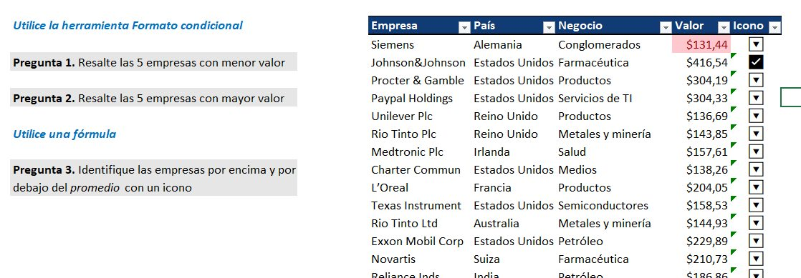
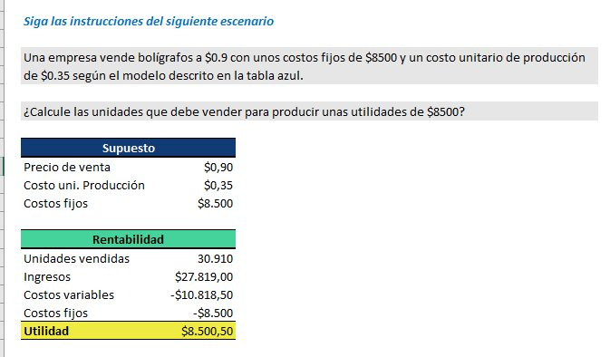
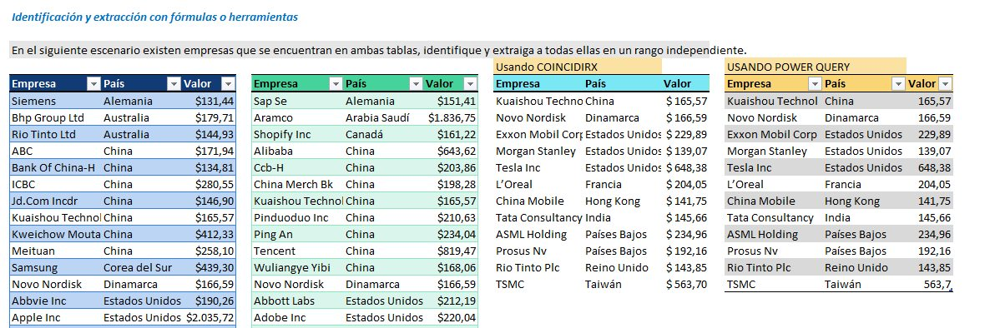

# Prueba Técnica EXCEL por niveles.

# Targets

* Nivel básico: se resuelve con formato condicional. usar tecla windows + . para sacar íconos, función SI, función PROMEDIO.
* Nivel Intermedio: usar Buscar objetivo de la pestaña DATOS/Análisis de hipótesis.
* Nivel avanzado: usar la función COINCIDIRX o sino Power Query.

## Screenshot

